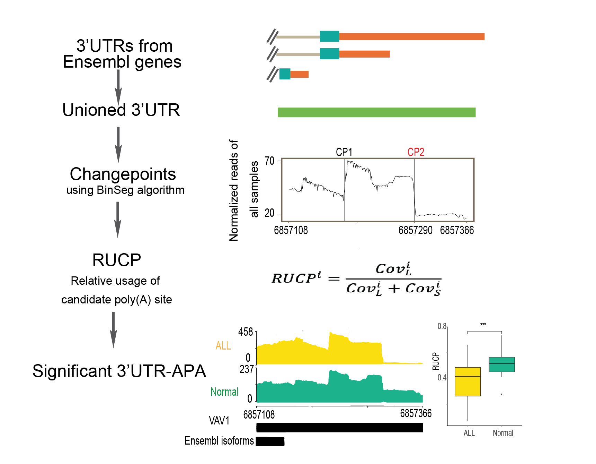

# Ida
Identify differential apa isoform in human/mouse hematopoiesis using high-throughput RNA-seq

installation
download package source
install.packages('./Ida', repos=NULL)

install from Github directly
devtools::install_github('Elvaxia/Ida')

